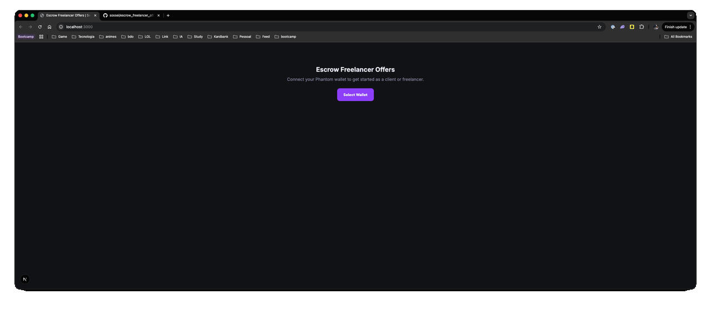

URL: https://escrow-freelancer-offers.vercel.app/
PS: OffChain e Storage Local, este projeto é somente para testes nõa deve ser usado oficialmente em mainnet, sem melhorias offchain!
# Escrow Freelancer Offers

Programa Solana construído com Anchor que implementa um escrow descentralizado entre clientes e freelancers usando SOL nativo.



---

## O que faz

Um **cliente** posta um job com um orçamento em SOL. Um **freelancer** envia uma proposta. Se o cliente aceitar, o SOL é bloqueado on-chain em um vault. Após o trabalho ser entregue, o cliente paga o freelancer (libera o SOL) ou cancela (recebe o SOL de volta).

```
Cliente posta job ──► Freelancer propõe ──► Cliente aceita (SOL bloqueado)
                                                    │
                                         ┌──────────┴──────────┐
                                    Pagar Freelancer       Cancelar Job
                                    (SOL liberado)        (SOL devolvido)
```

---

## Estrutura do projeto

```
escrow-challenge/
├── programs/escrow/src/lib.rs   ← Programa Anchor (Rust)
├── tests/escrow.ts              ← Testes de integração (TypeScript)
├── Anchor.toml                  ← Configuração do Anchor (cluster, wallet, program ID)
├── Cargo.toml                   ← Workspace Rust
├── package.json                 ← Dependências do test runner
└── app/                         ← Frontend Next.js 16
    ├── .env.local               ← RPC URL + program ID (gitignored — criar manualmente)
    ├── components/
    │   ├── EscrowApp.tsx        ← Alternador de visão + saldo + botão airdrop
    │   ├── ClientView.tsx       ← Postar jobs, gerenciar propostas, pagar/cancelar
    │   └── FreelancerView.tsx   ← Navegar jobs, enviar propostas, acompanhar status
    ├── e2e/
    │   └── tutorial.spec.ts     ← Testes Playwright (grava vídeo)
    ├── scripts/
    │   └── video-to-gif.mjs     ← Converte vídeo do Playwright em GIF
    ├── playwright.config.ts     ← Configuração do Playwright (vídeo ativado, 1280×720)
    └── lib/
        ├── useEscrowProgram.ts  ← Hooks que chamam o programa on-chain
        ├── mockDb.ts            ← Banco local em localStorage
        └── types.ts             ← Tipos TypeScript compartilhados
```

---

## Program ID

```
2v5LKTZViJQ7hQNz7YoARjyaDQoRZKDzX1VtX8Evdfxx
```

Mesmo ID para localnet e devnet (gerado pelo keypair em `target/deploy/`).

---

## Contas on-chain

O programa usa três tipos de contas, todas derivadas como PDAs (Program Derived Addresses — endereços determinísticos sem chave privada).

### JobOffer
Armazena um job postado pelo cliente.

| Campo | Tipo | Descrição |
|---|---|---|
| `client` | Pubkey | Carteira que criou o job |
| `job_id` | u64 | ID único gerado pelo cliente (seed do PDA) |
| `title` | String | Título do job (máx. 100 chars) |
| `description` | String | Descrição (máx. 500 chars) |
| `amount` | u64 | Pagamento em lamports (1 SOL = 1.000.000.000 lamports) |
| `status` | enum | `Open` → `Accepted` → `Completed` ou `Cancelled` |
| `freelancer` | Option\<Pubkey\> | Definido quando uma proposta é aceita |
| `bump` | u8 | Bump canônico do PDA |

Seeds do PDA: `["job_offer", client_pubkey, job_id_em_8_bytes]`

### JobProposal
Armazena a proposta de um freelancer para um job.

| Campo | Tipo | Descrição |
|---|---|---|
| `job_offer` | Pubkey | Job ao qual pertence essa proposta |
| `freelancer` | Pubkey | Carteira que enviou a proposta |
| `message` | String | Mensagem da proposta (máx. 300 chars) |
| `status` | enum | `Pending` → `Accepted` ou `Declined` |
| `bump` | u8 | Bump canônico do PDA |

Seeds do PDA: `["proposal", job_offer_pubkey, freelancer_pubkey]`

> Uma proposta por par (freelancer, job) — garantido pela unicidade do PDA.

### Vault (PDA anônimo)
Guarda o SOL bloqueado. Sem dados, apenas lamports.

Seeds do PDA: `["vault", job_offer_pubkey]`

---

## Instruções do programa

### `create_offer`
**Quem chama:** Cliente

Cria uma conta `JobOffer` on-chain.

```
Argumentos:
  job_id      u64     ID único (ex: Date.now())
  title       String  Título do job
  description String  Descrição do job
  amount      u64     Valor em lamports

Contas:
  job_offer   ← novo PDA (paga rent)
  client      ← signer + fee payer
  system_program
```

**Validações:** título ≤ 100 chars · descrição ≤ 500 chars · amount > 0

---

### `offer_proposal`
**Quem chama:** Freelancer

Cria uma conta `JobProposal` on-chain para um job específico.

```
Argumentos:
  message     String  Mensagem da proposta

Contas:
  job_offer   ← job existente (deve estar Open)
  proposal    ← novo PDA (paga rent)
  freelancer  ← signer + fee payer
  system_program
```

**Validações:** job deve estar `Open` · freelancer ≠ cliente · mensagem ≤ 300 chars · uma proposta por (freelancer, job)

---

### `accept_proposal`
**Quem chama:** Cliente

Aceita a proposta de um freelancer e **bloqueia o SOL no vault PDA**.

```
Argumentos: nenhum

Contas:
  job_offer   ← mut (status → Accepted)
  proposal    ← mut (status → Accepted)
  client      ← signer (SOL debitado daqui)
  vault       ← mut PDA (recebe o SOL bloqueado)
  system_program
```

**Efeito:** transfere `amount` lamports de `client` → `vault`. O SOL fica preso até `complete_proposal` ou `cancel_job`.

---

### `complete_proposal`
**Quem chama:** Cliente

Paga o freelancer — **libera o SOL do vault para a carteira do freelancer**.

```
Argumentos: nenhum

Contas:
  job_offer   ← mut (status → Completed)
  client      ← signer
  freelancer  ← mut (recebe o SOL)
  vault       ← mut PDA (SOL debitado daqui)
  system_program
```

**Efeito:** transfere `amount` lamports de `vault` → `freelancer` via assinatura PDA (sem chave privada).

---

### `cancel_job`
**Quem chama:** Cliente

Cancela o job. **Se estiver `Accepted`, devolve o SOL ao cliente.**

```
Argumentos: nenhum

Contas:
  job_offer   ← mut (status → Cancelled)
  client      ← signer (recebe SOL de volta se Accepted)
  vault       ← mut PDA
  system_program
```

**Efeito:**
- Se `Open`: apenas marca como Cancelado (sem SOL a devolver)
- Se `Accepted`: transfere `amount` lamports de `vault` → `client`, depois marca Cancelado

---

### `decline_proposal`
**Quem chama:** Cliente

Recusa a proposta de um freelancer. O job continua `Open` para outras propostas.

```
Argumentos: nenhum

Contas:
  job_offer   ← (status permanece Open)
  proposal    ← mut (status → Declined)
  client      ← signer
```

---

## Como testar (localnet)

### Pré-requisitos

```bash
solana --version       # >= 1.18
anchor --version       # 0.32.x
rustup show            # channel 1.89.0
node --version         # >= 18
```

Instalar Anchor se necessário:
```bash
cargo install --git https://github.com/coral-xyz/anchor avm --force
avm install 0.32.1
avm use 0.32.1
```

### Passo 1 — Instalar dependências

```bash
# Na raiz do projeto
npm install
```

Output esperado (normal):
```
removed 1 package, and audited 170 packages in 2s

6 vulnerabilities (1 low, 2 moderate, 3 high)
...
```

> Os avisos de vulnerabilidade são do toolchain de testes (mocha, chai) e **não afetam** o programa nem o código de produção.

### Passo 2 — Build do programa

```bash
anchor build
```

Gera:
- `target/deploy/escrow_freelancer_offers.so` — programa compilado
- `target/deploy/escrow_freelancer_offers-keypair.json` — keypair do programa
- `target/idl/escrow_freelancer_offers.json` — IDL
- `target/types/escrow_freelancer_offers.ts` — tipos TypeScript

### Passo 3 — Sincronizar o program ID

```bash
anchor keys sync
```

Atualiza o `declare_id!` no `lib.rs` e o `Anchor.toml` com o ID real gerado pelo keypair.

> Se pular esse passo, os testes falham com erro de "program ID mismatch".

### Passo 4 — Rodar os testes

```bash
anchor test
```

Esse comando:
1. Sobe um validador local (`solana-test-validator`)
2. Faz deploy do programa no localnet
3. Roda todos os testes em `tests/escrow.ts`
4. Derruba o validador

Output esperado:
```
escrow_freelancer_offers
  ✔ Cliente consegue criar uma oferta de job
  ✔ Freelancer consegue enviar uma proposta
  ✔ Cliente não pode enviar proposta no próprio job
  ✔ Cliente aceita proposta (SOL bloqueado no vault)
  ✔ Freelancer não pode chamar complete_proposal (só o cliente pode)
  ✔ Cliente paga o freelancer (completa a proposta)
  ✔ Cliente cancela job após aceitar (SOL devolvido)
  ✔ Cliente recusa uma proposta

  8 passing
```

### Testes com validador persistente (mais rápido)

```bash
# Terminal 1
solana-test-validator --reset

# Terminal 2
anchor test --skip-local-validator
```

---

## Como rodar o frontend

### Passo 1 — Configurar o `.env.local`

O arquivo **não está no repositório** (gitignored). Crie manualmente em `app/.env.local`:

**Para localnet:**
```env
NEXT_PUBLIC_RPC_URL=http://localhost:8899
NEXT_PUBLIC_PROGRAM_ID=2v5LKTZViJQ7hQNz7YoARjyaDQoRZKDzX1VtX8Evdfxx
```

**Para devnet:**
```env
NEXT_PUBLIC_RPC_URL=https://api.devnet.solana.com
NEXT_PUBLIC_PROGRAM_ID=2v5LKTZViJQ7hQNz7YoARjyaDQoRZKDzX1VtX8Evdfxx
```

### Passo 2 — Copiar a IDL

Após `anchor build`, copiar a IDL gerada para o frontend:

```bash
cd app
npm run copy-idl
```

### Passo 3 — Instalar dependências do app

```bash
cd app
npm install
```

### Passo 4 — Iniciar o validador (localnet apenas)

```bash
# Terminal separado
solana-test-validator --reset
```

### Passo 5 — Deploy do programa

```bash
# Localnet
anchor deploy

# Devnet
anchor deploy --provider.cluster devnet
```

### Passo 6 — Iniciar o frontend

```bash
cd app
npm run dev
```

Acesse [http://localhost:3000](http://localhost:3000).

Configure a Phantom para conectar em **Localnet** (`http://localhost:8899`) ou **Devnet** conforme o ambiente.

---

## Como conseguir SOL para testes

### Localnet (ilimitado)
O botão **"Airdrop 2 SOL"** no próprio frontend já faz isso automaticamente. Ou via CLI:
```bash
solana airdrop 2 --url localhost
```

### Devnet
O CLI costuma ter rate limit. Use os faucets web:

| Faucet | Link |
|---|---|
| Oficial Solana | https://faucet.solana.com |
| QuickNode | https://faucet.quicknode.com/solana/devnet |

Para ver seu endereço de deploy:
```bash
solana address
```

Para confirmar o saldo:
```bash
solana balance --url devnet
```

---

## Deploy no devnet (passo a passo)

```bash
# 1. Confirmar que tem SOL (via faucet acima)
solana balance --url devnet

# 2. Build
anchor build

# 3. Deploy
anchor deploy --provider.cluster devnet
```

O `Anchor.toml` já está configurado com o program ID correto para devnet:
```toml
[programs.devnet]
escrow_freelancer_offers = "2v5LKTZViJQ7hQNz7YoARjyaDQoRZKDzX1VtX8Evdfxx"
```

Após o deploy, atualizar `app/.env.local` para usar devnet (ver Passo 1 do frontend).

---

## Gravar tutorial com Playwright

O Playwright está configurado para gravar vídeo de cada teste automaticamente.

### Rodar e gravar

```bash
cd app
npm run test:e2e
```

Os vídeos `.webm` são salvos em `app/test-results/`.

### Modo interativo (você controla o browser)

```bash
cd app
npm run test:e2e:ui
```

### Converter vídeo em GIF

Requer `ffmpeg` instalado (`brew install ffmpeg`):

```bash
npm run gif -- test-results/PASTA/video.webm tutorial.gif

# Controlar fps e largura (opcional)
npm run gif -- video.webm demo.gif 12 800
```

---

## Fluxo do frontend

### Visão "Preciso de alguém para fazer" (Cliente)

1. Conectar carteira (Phantom)
2. **Postar um Job** — título, descrição, valor em SOL → chama `create_offer`
3. **Ver propostas** dos freelancers em cada job
4. **Aceitar** uma proposta → chama `accept_proposal` (SOL bloqueado)
5. Após o trabalho entregue:
   - **Pagar Freelancer** → chama `complete_proposal` (SOL liberado)
   - **Cancelar Job** → chama `cancel_job` (SOL devolvido)

### Visão "Quero fazer" (Freelancer)

1. Conectar carteira (diferente da do cliente)
2. **Navegar jobs abertos** — todos os jobs de outras carteiras
3. **Enviar Proposta** — escrever mensagem → chama `offer_proposal`
4. **Acompanhar propostas** — status: `pendente` / `aceita` / `recusada`
5. Quando aceito: aguardar o cliente liberar o pagamento

### Funcionalidades do cabeçalho

- **Saldo em tempo real** — atualiza a cada 5 segundos, fica vermelho se < 0.01 SOL
- **Airdrop 2 SOL** — funciona em localnet e devnet (via RPC configurado no `.env.local`)

---

## Erros comuns

| Erro | Causa | Solução |
|---|---|---|
| `Program ID mismatch` | `declare_id!` não bate com o keypair | Rodar `anchor keys sync` |
| `IDL not found` | `app/lib/escrow_freelancer_offers.json` é placeholder | Rodar `anchor build` e depois `npm run copy-idl` em `/app` |
| `.env.local not found` | Arquivo não existe (gitignored) | Criar manualmente — ver seção "Como rodar o frontend" |
| `Insufficient funds` | Carteira sem SOL | Usar faucet — ver seção "Como conseguir SOL" |
| `airdrop request failed` | Rate limit do devnet | Usar faucet web: faucet.solana.com |
| `JobNotOpen` | Tentou propor/aceitar em job que não está aberto | Verificar status do job no UI |
| `NotJobClient` | Carteira errada assinando ação de cliente | Verificar qual carteira está conectada |
| `Account not found` | Validador reiniciou, contas foram apagadas | Fazer redeploy: `anchor deploy` |
| `CommonJs/ESM mismatch` | `"type"` errado no `app/package.json` | Garantir `"type": "module"` no `app/package.json` |
